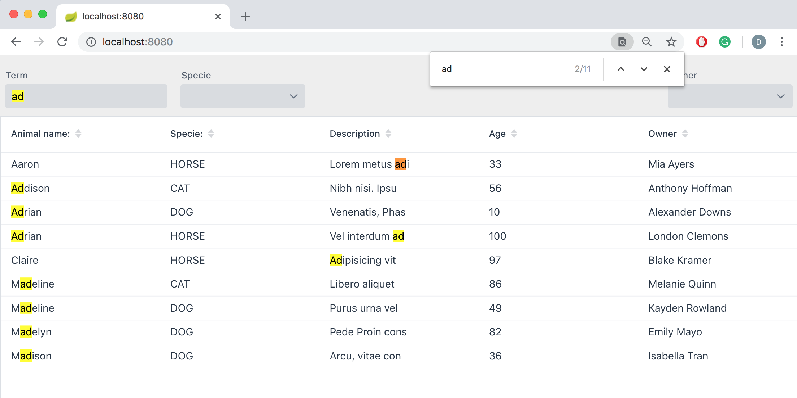
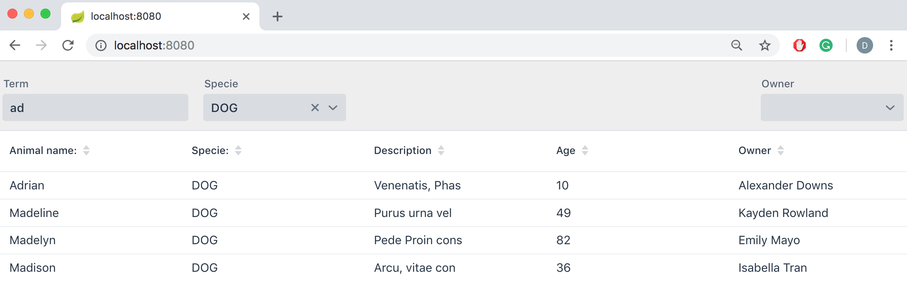
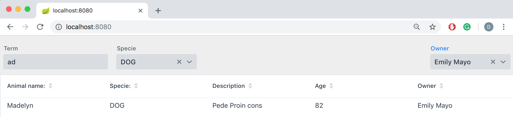

# dynamic-filter
Filtering items on a Vaadin Grid using a dynamic filter

The goal of this tutorial is to create a dynamic filter that allows to filter the content of a grid in a dynamic way.

The basic idea to create a dynamic filter, it is to use criteria api to create a dynamic query, in which the
constrains of the filter are translated into predicates inside the where clause.

## Example









## IDE
Import the project to the IDE of your choosing as a Maven project.
 
## Run application

To run the application in development time, enter the following Maven
command:  
```
mvn spring-boot:run
```

Open [http://localhost:8080/](http://localhost:8080/) in browser to see
the application.
